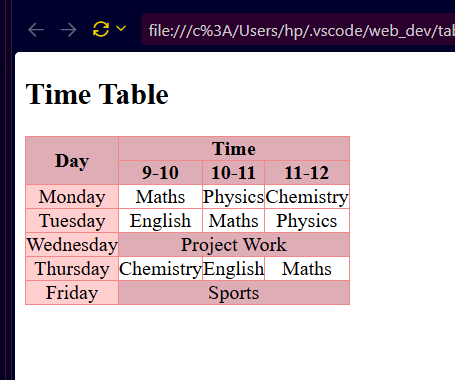

## Daily Time Table

A clean and structured **Weekly Time Table** created using **HTML5 and CSS3**.
This project demonstrates the use of HTML table structure along with `rowspan` and `colspan` to organize subjects and time slots effectively.

## 📌 Project Overview

The timetable represents a Monday-to-Friday academic schedule with three daily time slots:

* **9:00 AM – 10:00 AM**
* **10:00 AM – 11:00 AM**
* **11:00 AM – 12:00 PM**

Special activities such as **Project Work** and **Sports** span across all three time slots using the `colspan` attribute.

## 🛠️ Technologies Used

* **HTML5** – Table structure and content
* **CSS3** – Borders, alignment, spacing, and colors

## ✨ Key HTML Concepts

* `<table>` – Creates the table
* `<thead>` – Defines the table header
* `<tbody>` – Contains the timetable data
* `<tr>` – Creates table rows
* `<th>` – Defines table headings
* `<td>` – Defines table cells
* `rowspan` – Merges cells vertically
* `colspan` – Merges cells horizontally

## 🎨 Features

* Structured weekly academic timetable
* Clear day and time-slot organization
* `rowspan` used for the **Day** heading
* `colspan` used for **Time**, **Project Work**, and **Sports**
* Basic CSS styling for a clean visual appearance
* Beginner-friendly HTML project

## 📸 Project Preview


## 📂 Project Structure
```text
Time-Table/
│
├── index.html
├── screenshot.png
└── README.md
```

## 🚀 How to Run

1. Clone or download this repository.
2. Open `index.html` in any web browser.
3. View the weekly timetable.

## 🎯 Learning Outcome

This project helped me understand how to structure HTML tables and use `rowspan` and `colspan` to merge cells and create more organized layouts.

---

**Created as part of my HTML & CSS learning journey.**
